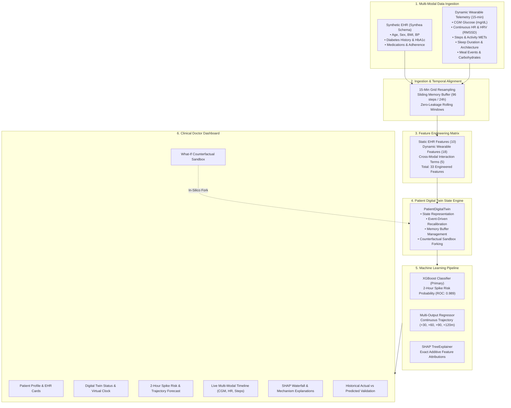

# GlucoTwin AI — A Patient-Specific Digital Twin for Early Prediction of Glucose Spikes

> **“Simulate the Patient. Predict the Risk. Act Before the Spike.”**

[](https://happiesthealth.com)
[-red?style=for-the-badge&logo=youtube)](https://youtu.be/vMN9JIIlMq4)
[](#)
[](LICENSE)
[](https://python.org)
[](https://fastapi.tiangolo.com)
[](https://react.dev)

---

## 1. Project Title
**GlucoTwin AI — A Patient-Specific Digital Twin for Early Prediction of Glucose Spikes**

## 2. One-Line Tagline
*“Simulate the Patient. Predict the Risk. Act Before the Spike.”*

---

## 👥 Team Details & Institutional Affiliation
- **Team Lead / Member:** Puja Lokku
- **GitHub:** [@pujalokku49-stack](https://github.com/pujalokku49-stack)
- **Email:** pujalokku49@gmail.com
- **Role:** AI/ML Healthcare Engineer & Full-Stack Developer

## 🎓 College / Incubator Information
- **Institution / Incubator:** Happiest Health Digital Twin Challenge 2026 / Academic & Innovation Cohort
- **Department:** AI & Healthcare Data Science

---

> ⚠️ **MANDATORY CLINICAL & REGULATORY DISCLAIMER:**  
> **RESEARCH & DECISION-SUPPORT DEMONSTRATION ONLY.** GlucoTwin AI is a proof-of-concept digital twin decision-support system built for the **Happiest Health Digital Twin Challenge 2026**. It is **not a certified medical device** (FDA/CDSCO), does not provide medical diagnosis, and must not replace professional clinical medical judgment or prescribe medications.

---

## 3. Problem Statement
Type 2 Diabetes Mellitus (T2D) affects over 537 million people worldwide. In routine outpatient care, clinicians evaluate glycemic control using periodic glycated hemoglobin (HbA1c) tests. However, **HbA1c represents only a 90-day macroscopic average** and fails to capture acute intraday glycemic volatility.

Acute postprandial glucose spikes ($\ge 180\text{ mg/dL}$) inflict severe acute vascular endothelial shear stress, trigger oxidative damage, and directly drive diabetic retinopathy, nephropathy, peripheral neuropathy, and cardiovascular events. Conventional self-monitoring of blood glucose (SMBG) finger-prick checks are **reactive**—identifying spikes only after physiological damage has occurred.

## 4. Motivation
Postprandial hyperglycemia is governed by complex, multi-scale interactions between:
- **Long-term biological factors:** Pancreatic beta-cell reserve, adiposity-induced peripheral insulin resistance, and baseline medication adherence.
- **Dynamic lifestyle variables:** Meal carbohydrate loads, digestive absorption rates, physical activity (which promotes GLUT4-mediated insulin-independent glucose disposal), and sleep debt (which elevates morning cortisol and autonomic stress).

Current Continuous Glucose Monitors (CGMs) report current numbers with passive trend arrows, but lack the intelligence to model *how a specific patient’s unique physiology will respond over the subsequent 2 hours*. GlucoTwin AI solves this by continuously synchronizing static clinical records with dynamic wearable telemetry to predict acute spikes before they manifest.

## 5. Healthcare Use Case
- **Clinical Decision Support:** Enables endocrinologists to review personalized glycemic volatility patterns and identify high-risk postprandial vulnerability windows.
- **Proactive Patient Guidance:** Alerts individuals 2 hours in advance of an impending spike, empowering timely preventative actions (such as a 20-minute post-meal walk or adjusting carbohydrate intake).
- **In-Silico What-If Sandbox:** Allows physicians to demonstrate to patients exactly how behavioral modifications (e.g., adding 2,500 steps or moderating meal carbohydrates) decouple their forecasted glycemic trajectory away from the danger zone.

---

## 6. What is a Digital Twin?
A **Digital Twin** in healthcare is an evolving, bidirectional virtual model of a patient's physical and biological system. Unlike static predictive models that process an isolated row of inputs, a digital twin:
1. Maintains continuous state awareness over time.
2. Integrates multi-modal data streams across disparate timescales (decades of EHR history + seconds of wearable telemetry).
3. Preserves a memory buffer of physiological responses.
4. Enables counterfactual (*what-if*) simulation of interventions in silico without risking patient health.

## 7. Why This Project is a Digital Twin
GlucoTwin AI is **not a simple tabular classifier**. It is architected as an evolving physiological entity (`PatientDigitalTwin` class):
- **Patient Profile:** Static long-term characteristics from EHR (age, sex, BMI, diabetes duration, baseline HbA1c, fasting glucose, medication regimen).
- **Historical Memory Buffer:** Sliding 24-hour memory window (96 intervals of 15 minutes) capturing diurnal baseline drift and circadian rhythms.
- **Current State:** Dynamic metabolic representation continuously updated with every incoming wearable packet.
- **Evolving State Loop:** New Observation $\rightarrow$ State Update $\rightarrow$ Feature Recalculation $\rightarrow$ Model Inference $\rightarrow$ Risk State Recalibration $\rightarrow$ Dashboard Synchronization.
- **Counterfactual Cloning:** Clones the patient's internal state to simulate interventions and forecast alternative futures.

---

## 8. System Architecture


---

## 9. Data Sources
| Stream | Nature | Source / Architecture | Resolution |
| :--- | :--- | :--- | :--- |
| **Electronic Health Records (EHR)** | Static / Historical | Synthea-modeled synthetic patient cohort (50 patients) | Baseline clinical profile |
| **Continuous Glucose Monitor (CGM)** | Dynamic Time-Series | Physiologically grounded metabolic simulation layer | 15-minute intervals |
| **Wearable / IoT Telemetry** | Dynamic Time-Series | Simulated wrist sensor telemetry (HR, HRV, Steps, Sleep) | 15-minute intervals |

> **Ethical Data Declaration:** Absolutely zero real identifiable patient health information (PHI) is used. All data is generated reproducibly using fixed seeds (`seed=42`).

## 10. Data-Generation Methodology
The time-series generation implements a discrete-time metabolic simulation incorporating:
- **Baseline Physiology:** Fasting glucose, HbA1c, and insulin resistance index $IR = \frac{\text{BMI}}{22} \times \frac{\text{HbA1c}}{6} \times (1 + \text{duration} \times 0.02)$.
- **Gastric Influx:** Meals generate a delayed absorption curve peaking at 45–60 minutes.
- **Physical Activity:** Step counts drive muscular glucose uptake via GLUT4 translocation and increase heart rate while modulating HRV.
- **Sleep Deficit:** Sleep duration $<6.5\text{ hours}$ increases morning insulin resistance by up to 25%.
- **Medication Attenuation:** Metformin suppresses hepatic gluconeogenesis; SGLT2 inhibitors and GLP-1/DPP-4 agents attenuate glycemic excursion.

---

## 11. Feature Engineering
A total of **33 physiological features** are engineered:
1. **Static Patient EHR (10):** `age`, `bmi`, `diabetes_duration_years`, `hba1c`, `fasting_glucose`, `systolic_bp`, `diastolic_bp`, `has_insulin`, `has_metformin`, `num_medications`.
2. **Dynamic Wearables (18):** `current_glucose`, `glucose_delta_15m`, `glucose_delta_30m`, `glucose_slope_hourly`, `glucose_roll_mean_1h`, `glucose_roll_std_1h`, `glucose_roll_mean_3h`, `heart_rate`, `hr_roll_mean_1h`, `hr_delta_1h`, `hrv`, `hrv_roll_mean_1h`, `steps_1h`, `steps_3h`, `sleep_duration_hours`, `sleep_quality_score`, `time_since_meal_min`, `meal_carbs_recent`.
3. **Cross-Modal Interactions (5):**
   - $\text{Sleep Debt} \times \text{Glucose Interaction} = \max(0, 8.0 - \text{sleep}) \times \text{glucose}$
   - $\text{Activity-to-Glucose Ratio} = \frac{\text{steps}_{\text{1h}}}{\text{glucose} + 1}$
   - $\text{Carbohydrate-to-Activity Balance} = \frac{\text{carbs}_{\text{recent}}}{\text{steps}_{\text{1h}} + 50}$
   - $\text{BMI} \times \text{Glucose Slope Interaction} = \text{BMI} \times \text{slope}$
   - $\text{Metabolic Strain Index} = \frac{\text{HbA1c}}{6.0} \times \frac{\text{glucose}}{100.0}$

---

## 12. AI/ML Model and Framework Details
- **ML & Scientific Frameworks:** Scikit-Learn, XGBoost, SHAP (SHapley Additive exPlanations), PyTorch, NumPy, Pandas
- **Primary Classification Engine:** XGBoost Classifier (`n_estimators=160`, `max_depth=5`, `learning_rate=0.06`, `scale_pos_weight` tuned for class imbalance). Achieves **ROC-AUC: 0.9894**, **PR-AUC: 0.9833**, **F1-Score: 0.9217**, and **Recall (Sensitivity): 91.0%**.
- **Multi-Horizon Trajectory Regressor:** MultiOutputRegressor wrapping Gradient Boosted Regressors to predict continuous glucose values at $+30\text{m}$, $+60\text{m}$, $+90\text{m}$, and $+120\text{m}$ (MAE: 7.50 to 14.48 mg/dL).
- **Baseline Benchmarks:** Logistic Regression (standardized features with balanced class weights) and Random Forest (120 estimators).
- **Explainability Framework (XAI):** SHAP TreeExplainer for exact mathematical additive Shapley feature attributions.
- **Validation Protocol:** Grouped patient-level hold-out split (40 patients train / 10 patients hold-out test) guaranteeing zero forward temporal leakage.

---

## 13. Digital Twin State Engine
The state engine is encapsulated in the `PatientDigitalTwin` class:
```python
class PatientDigitalTwin:
    def __init__(self, patient_profile: PatientProfile, initial_history: List[Observation] = None): ...
    def ingest_observation(self, obs: Observation) -> DigitalTwinState: ...
    def simulate_counterfactual(self, scenario: WhatIfScenario) -> CounterfactualComparison: ...
    def get_state(self) -> DigitalTwinState: ...
```
When a new wearable observation arrives, the state engine shifts the internal sliding window, computes features, updates inference models, runs SHAP attribution, and emits the updated state.

---

## 14. Prediction Methodology
- **Target Event:** Significant glucose spike within the next 2 hours, defined as:
  $$\text{Spike}_{2h} = 1 \iff \max_{t \in [0, 120\text{m}]} G(t) \ge 180\text{ mg/dL} \quad \lor \quad \max_{t \in [0, 120\text{m}]} (G(t) - G_0) \ge 50\text{ mg/dL}$$
- **Risk Tiers:**
  - **LOW:** Probability $<35\%$
  - **MODERATE:** Probability $35\% - 64\%$
  - **HIGH:** Probability $\ge 65\%$
- **Trajectory Forecast:** Point predictions at $+30\text{m}$, $+60\text{m}$, $+90\text{m}$, and $+120\text{m}$ with trend classification (`RAPID_INCREASE`, `MILD_INCREASE`, `STEADY`, `DECREASING`).

---

## 15. Explainable AI (SHAP)
Predictions integrate **SHAP (SHapley Additive exPlanations)** via `TreeExplainer`:
- Calculates exact marginal contributions for every feature in milliseconds.
- Partitions factors into **Risk Drivers** (positive SHAP values pushing towards a spike) vs **Protective Factors** (negative SHAP values stabilizing glucose).
- Clinically translated into doctor-friendly mechanistic explanations.

---

## 16. What-If Simulation
The dashboard sandbox allows doctors or patients to simulate counterfactual lifestyle scenarios:
- **Sliders:** Sleep duration ($4.0 - 9.5\text{h}$), physical activity past 1h ($0 - 6,000\text{ steps}$), meal carbohydrates ($0 - 110\text{g}$), pre-event glucose ($80 - 240\text{ mg/dL}$).
- **Outcome:** Reruns inference on a cloned state and presents a side-by-side comparison of baseline vs simulated risk percentage, delta, and trajectory overlay.
- **Mandatory Tag:** *“Model-based scenario simulation — not a medical recommendation.”*

---

## 17. Doctor Dashboard
Built with **React 18 + Vite + Tailwind CSS + Recharts + Lucide Icons**:
1. **Patient Overview:** Complete EHR profile, HbA1c, and medications.
2. **Digital Twin Status:** Active status, virtual clock, and streaming replay controls.
3. **Live Telemetry Timeline:** CGM curve with $70-140\text{ mg/dL}$ target band and $180\text{ mg/dL}$ danger line, HR, HRV, and steps.
4. **Prediction Panel:** Circular risk gauge, trend direction, and multi-horizon curve.
5. **SHAP Waterfall:** Real feature attribution ranking.
6. **What-If Sandbox:** Live intervention sliders and trajectory comparison.
7. **Historical Trends:** Longitudinal correlations and actual vs predicted validation audits.

---

## 18. Actual Evaluated Results
*Measured strictly on 10 unseen test patients ($6,640$ observations):*

### Classification Benchmarks (2-Hour Spike Prediction)
| Model | Role | ROC-AUC | PR-AUC | F1-Score | Precision | Recall (Sensitivity) |
| :--- | :--- | :---: | :---: | :---: | :---: | :---: |
| **Logistic Regression** | Baseline | $0.9769$ | $0.9642$ | $0.8858$ | $86.9\%$ | $90.4\%$ |
| **Random Forest** | Comparator | $0.9831$ | $0.9752$ | $0.9074$ | $91.5\%$ | $90.0\%$ |
| **XGBoost Classifier** | **Primary Engine** | **0.9894** | **0.9833** | **0.9217** | **93.4%** | **91.0%** |

### Multi-Horizon Trajectory Regressor Accuracy
| Forecast Horizon | Mean Absolute Error (MAE) | Root Mean Squared Error (RMSE) |
| :--- | :---: | :---: |
| **+30 Minutes** | $7.50\text{ mg/dL}$ | $18.83\text{ mg/dL}$ |
| **+60 Minutes** | $10.19\text{ mg/dL}$ | $21.48\text{ mg/dL}$ |
| **+90 Minutes** | $12.67\text{ mg/dL}$ | $23.90\text{ mg/dL}$ |
| **+120 Minutes** | $14.48\text{ mg/dL}$ | $26.03\text{ mg/dL}$ |

---

## 19. System Limitations
1. **Interstitial Sensor Lag:** Subcutaneous CGM interstitial glucose lags venous blood by 5–15 minutes.
2. **Synthetic Data Realism:** Synthetic models do not fully replicate real-world sensor dropouts, compression artifacts, or acute inflammatory illness.
3. **Complex Pharmacokinetics:** Current model uses linear medication attenuation rather than multi-compartment insulin pharmacokinetics.
4. **Psychological Stress:** Emotional distress / cortisol surges are only approximated via heart-rate variability.

---

## 20. Ethical Considerations
- GlucoTwin AI is an **assistive decision-support system**, not an autonomous agent.
- It does not recommend medication titrations or alter insulin dosages.
- It provides risk probabilities and lifestyle simulations to empower informed clinical discussions.

## 21. Privacy & Security
- 100% synthetic data generated with deterministic seeds. No real protected health information (PHI) is present.
- Fully local execution architecture: no health data is transmitted to external proprietary cloud endpoints.

---

## 22. Future Scope
- **HL7 FHIR Interoperability:** Native connectivity to hospital electronic health record systems.
- **Direct Sensor APIs:** Real-time ingestion via Dexcom Web API and Apple HealthKit / Google Health Connect.
- **Smartphone Vision:** Computer vision for automated carbohydrate estimation from meal photographs.
- **Closed-Loop Artificial Pancreas:** Integration with automated insulin delivery algorithms.

---

## 23. Installation

### Prerequisites
- Python 3.10+ (tested through Python 3.14)
- Node.js 18+ and npm 9+

### Backend Setup
```bash
cd backend
python -m pip install -r requirements.txt
```

### Frontend Setup
```bash
cd frontend
npm install
```

---

## 24. Running Locally

### Step 1: Generate Data & Train Models (If not already present)
```bash
cd backend
python -m app.data.generator
python -m app.ml.train
```

### Step 2: Start the FastAPI Backend
```bash
cd backend
python -m uvicorn app.main:app --host 127.0.0.1 --port 8000 --reload
```
The backend API and interactive OpenAPI documentation will be available at:
- API Base: `http://127.0.0.1:8000`
- Swagger Docs: `http://127.0.0.1:8000/docs`

### Step 3: Start the React Frontend Dashboard
```bash
cd frontend
npm run dev
```
Open your browser at:
`http://localhost:5173`

---

## 25. API Documentation

| Endpoint | Method | Description |
| :--- | :---: | :--- |
| `/api/system-info` | `GET` | Application metadata, tagline, and disclaimer |
| `/api/patients` | `GET` | List all synthetic patient EHR profiles |
| `/api/patients/{id}` | `GET` | Retrieve single patient profile |
| `/api/patients/{id}/current-state` | `GET` | Full living Digital Twin state |
| `/api/patients/{id}/history` | `GET` | Historical multi-modal observations |
| `/api/patients/{id}/prediction` | `GET` | 2-hour spike risk score and trajectory |
| `/api/patients/{id}/explanation` | `GET` | SHAP TreeExplainer feature attributions |
| `/api/patients/{id}/simulate` | `POST` | Execute What-If counterfactual scenario |
| `/api/patients/{id}/step` | `POST` | Ingest next wearable observation (advance virtual clock) |
| `/api/patients/{id}/reset` | `POST` | Reset patient simulation to baseline anchor |
| `/api/model-metrics` | `GET` | Measured model performance benchmarks |

---

## 26. Project Structure
```text
glucotwin-ai/
├── backend/
│   ├── app/
│   │   ├── api/
│   │   │   └── routes.py              # FastAPI REST endpoints
│   │   ├── data/
│   │   │   └── generator.py           # Physiologically grounded data simulation
│   │   ├── digital_twin/
│   │   │   ├── engine.py              # PatientDigitalTwin state engine & What-If
│   │   │   ├── manager.py             # Active twin registry & replay controller
│   │   │   └── state.py               # Pydantic schemas for state, predictions & XAI
│   │   ├── ml/
│   │   │   ├── features.py            # 33-dimensional feature engineering pipeline
│   │   │   └── train.py               # ML training, evaluation & SHAP serialization
│   │   ├── config.py                  # Global settings, paths & disclaimers
│   │   └── main.py                    # FastAPI application entrypoint with CORS
│   ├── data_store/                    # Generated EHR profiles & timeseries CSVs
│   ├── saved_models/                  # Serialized XGBoost, Regressors, SHAP & report
│   └── requirements.txt
├── frontend/
│   ├── src/
│   │   ├── components/
│   │   │   ├── DigitalTwinStatus.jsx  # Status badge, clock & streaming controls
│   │   │   ├── ExplainabilityView.jsx # SHAP waterfall & mechanism cards
│   │   │   ├── HistoricalTrends.jsx   # Correlation charts & actual vs predicted table
│   │   │   ├── LiveTimeline.jsx       # Multi-modal CGM, HR, Steps & Meals chart
│   │   │   ├── ModelMetricsView.jsx   # Measured model benchmark comparison page
│   │   │   ├── PatientOverview.jsx    # Static EHR card & demo persona selector
│   │   │   ├── PredictionPanel.jsx    # 2-hour risk gauge & trajectory curve
│   │   │   ├── SafetyDisclaimer.jsx   # Clinical decision-support disclaimer banner
│   │   │   └── WhatIfSimulator.jsx    # Interactive sandbox with counterfactual delta
│   │   ├── services/
│   │   │   └── api.js                 # Frontend API client
│   │   ├── App.jsx                    # Main application orchestrator
│   │   ├── index.css                  # Tailwind styles & clinical theme
│   │   └── main.jsx
│   ├── package.json
│   ├── vite.config.js
│   └── tailwind.config.js
├── docs/
│   ├── ARCHITECTURE.md                # System architecture with Mermaid diagrams
│   ├── PRESENTATION_SCRIPT.md         # 20+ minute demonstration walkthrough transcript
│   ├── generate_architecture_pdf.py   # Script generating architecture PDF
│   ├── generate_presentation_pdf.py   # Script generating 20-slide presentation PDF
│   ├── architecture_diagram.pdf       # Exported high-resolution Architecture PDF
│   └── presentation.pdf               # Exported 20-slide Presentation Deck PDF
├── .env.example
├── .gitignore
├── LICENSE
└── README.md
```

---

## 27. 15-20 Minute Demo Video Link
- 🎥 **Demo Video (Unlisted YouTube):** [**Watch GlucoTwin AI 15–20 Minute Video Demonstration on YouTube**](https://youtu.be/vMN9JIIlMq4)  
  *Direct Link: `https://youtu.be/vMN9JIIlMq4` (Uploaded as Unlisted for Happiest Health 2026 Jury Evaluation)*
- 📄 **Full Video Presentation Script & Slide-by-Slide Transcript:** [`docs/PRESENTATION_SCRIPT.md`](docs/PRESENTATION_SCRIPT.md)

## 28. Architecture Diagram in PDF/PPT Format
The high-resolution architectural diagram PDF illustrating multi-modal data fusion, the digital twin state engine, and the ML prediction layer is available at:
👉 [`docs/architecture_diagram.pdf`](docs/architecture_diagram.pdf)

## 29. Presentation in PDF/PPT Format Covering Project Details & Outcomes
The complete 20-slide presentation deck covering problem framing, physiological digital twin engine, machine learning benchmarks, clinical dashboard, ethical audit, and healthcare impact is available at:
👉 [`docs/presentation.pdf`](docs/presentation.pdf)

## 30. Open-Source License Details
This project is licensed under the permissive **MIT License** — see the [`LICENSE`](LICENSE) file. It allows open-source academic, clinical, and commercial research extension without restrictive proprietary lock-in.

## 31. Public Accessibility
All code, synthetic datasets, trained model weights, documentation, architecture diagrams, and presentation materials in this repository are **100% publicly accessible without any additional permissions or login requirements**.
