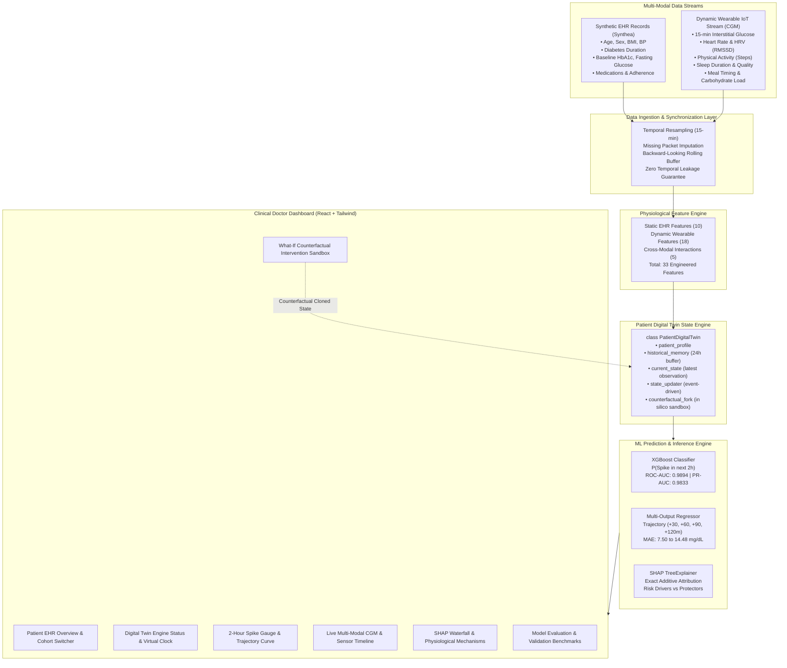

# GlucoTwin AI — System Architecture Specification

## 1. High-Level Architectural Flow



---

## 2. Digital Twin State Engine Design

The central component of the system is the `PatientDigitalTwin` class located at `backend/app/digital_twin/engine.py`.

```python
class PatientDigitalTwin:
    patient_profile: PatientProfile       # Immutable / long-term EHR characteristics
    recent_history: List[Observation]    # Sliding memory buffer (up to 96 steps = 24h)
    current_observation: Observation     # Latest synchronized 15-min sensor packet
    current_features: Dict[str, float]   # 33-dimensional engineered feature vector
    prediction: PredictionResult         # 2-hour spike probability & trajectory
    explanation: ExplainabilityReport    # SHAP feature impact attribution
```

### State Evolution Lifecycle:
1. **Wearable Observation Ingestion:** A new 15-minute sensor packet arrives via `ingest_observation(obs)`.
2. **Memory Buffer Shift:** The current observation is committed to `recent_history`; observations older than 24 hours (96 steps) are rotated out.
3. **Feature Recalculation:** The 33-dimensional feature vector is re-computed strictly using backward-looking windows.
4. **Machine Learning Inference:**
   - Classification pipeline evaluates `P(Spike in 2h)`.
   - Multi-horizon regressor predicts continuous trajectory at `+30m`, `+60m`, `+90m`, and `+120m`.
5. **SHAP TreeExplainer Execution:** Computes exact additive attributions for each feature.
6. **State Broadcast:** Emits the updated `DigitalTwinState` to connected clinical dashboards.

---

## 3. What-If Counterfactual Sandbox Engine

The What-If Simulator does **not** rely on static heuristics. It executes a complete in-silico simulation:
1. Clones the patient's current `DigitalTwinState` into an isolated simulated instance.
2. Applies user-selected parameter overrides (`sleep_duration_hours`, `steps_1h`, `meal_carbs_g`, `current_glucose`).
3. Re-computes the complete feature matrix, accounting for non-linear interactions:
   $$\text{SleepDebt} \times \text{Glucose} = \max(0, 8.0 - \text{Sleep}) \times \text{Glucose}$$
   $$\text{ActivityRatio} = \frac{\text{Steps}_{\text{1h}}}{\text{Glucose} + 1}$$
   $$\text{CarbBalance} = \frac{\text{Carbs}_{\text{recent}}}{\text{Steps}_{\text{1h}} + 50}$$
4. Re-runs the XGBoost classifier and multi-output regressor on the counterfactual state.
5. Returns a side-by-side comparative delta showing before-and-after risk levels and trajectory decoupling curves.

---

## 4. REST API Specification

| HTTP Method | Route | Description |
| :--- | :--- | :--- |
| `GET` | `/api/system-info` | Metadata, tagline, and safety disclaimer |
| `GET` | `/api/patients` | Cohort directory of synthetic patients |
| `GET` | `/api/patients/{id}` | Detailed static EHR profile |
| `GET` | `/api/patients/{id}/current-state` | Full living Digital Twin state |
| `GET` | `/api/patients/{id}/history` | Multi-modal historical telemetry for charts |
| `GET` | `/api/patients/{id}/prediction` | Active 2-hour spike risk & trajectory |
| `GET` | `/api/patients/{id}/explanation` | SHAP TreeExplainer attributions |
| `POST` | `/api/patients/{id}/simulate` | Runs counterfactual what-if intervention |
| `POST` | `/api/patients/{id}/step` | Ingests next wearable packet (advances clock) |
| `POST` | `/api/patients/{id}/reset` | Resets patient simulation to baseline anchor |
| `GET` | `/api/model-metrics` | Actual measured benchmark report |
